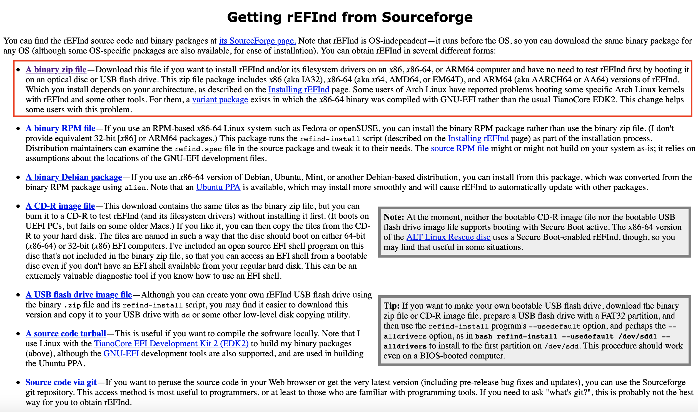
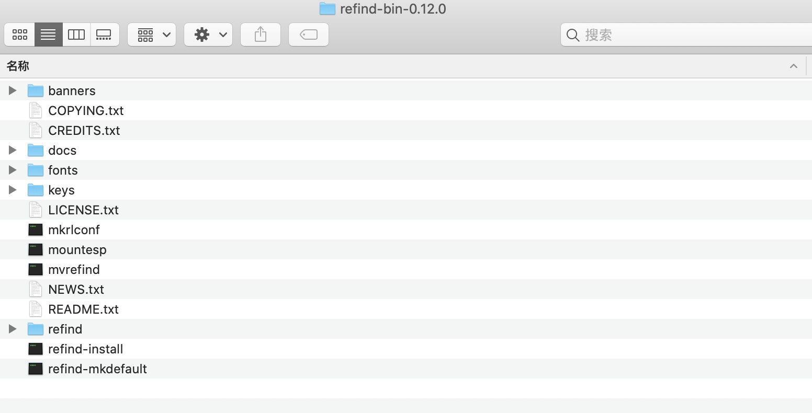
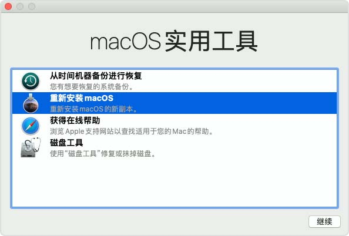

# 5.1 rEFInd安装

## 包下载

### 官网

[The rEFInd Boot Manager](http://www.rodsbooks.com/refind/)

### 二进制包下载地址

[二进制包:``http://www.rodsbooks.com/refind/getting.html``](http://www.rodsbooks.com/refind/getting.html)

### 二进制包倒入U盘

## Mac 苹果设备下安装

###  按``COMMAND+R``进入recovery界面

###  屏幕左上角 `` Utilies``  : `` Terminal ``  进入终端命令行

* 执行 `` cd / `` 进入根目录

* 执行 `` ls``  找到 ``Volumes `` 

* 执行 `` cd  Volumes/`` 进入磁盘文件夹 

* 执行 `` ls ``  找到自己的U盘根目录

* 执行 `` cd U盘/`` 进入U盘文件目录

* 执行 `` ls``  找到 之前保存在U盘中的二进制文件`` refind-bin-0.12.0``

* 执行 `` cd   refind-bin-0.12.0/`` 进入 rEFInd 安装包目录 

* 执行 `` ls``  找到 `` refind-install `` 

* 执行 `` ./ refind-install``

* 等待执行结果 如果询问是否安装 选择YES 等待执行完成即可

