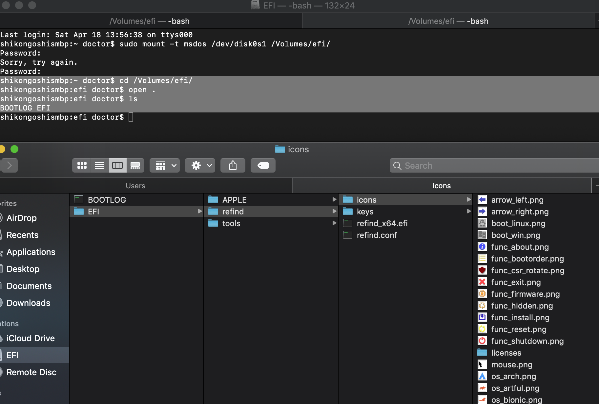

# 5.2 rEFInd配置


## Mac 配置 rEFInd


### 打开终端输入``diskutil list``并定位efi分区

```

shikongoshismbp:~ doctor$ diskutil list
/dev/disk0 (internal, physical):
   #:                       TYPE NAME                    SIZE       IDENTIFIER
   0:      GUID_partition_scheme                        *251.0 GB   disk0
   1:                        EFI EFI                     209.7 MB   disk0s1
   2:                 Apple_APFS Container disk1         250.8 GB   disk0s2

/dev/disk1 (synthesized):
   #:                       TYPE NAME                    SIZE       IDENTIFIER
   0:      APFS Container Scheme -                      +250.8 GB   disk1
                                 Physical Store disk0s2
   1:                APFS Volume Macintosh HD            131.0 GB   disk1s1
   2:                APFS Volume Preboot                 43.3 MB    disk1s2
   3:                APFS Volume Recovery                510.4 MB   disk1s3
   4:                APFS Volume VM                      1.1 GB     disk1s4


```


### 这里efi分区在/dev/disk0s1，找到并挂载它方便修改

##### 创建efi 文件夹 ``mkdir /Volumes/efi`` 找到并挂载它方便修改


* 创建并找到


```
shikongoshismbp:~ doctor$ sudo mkdir /Volumes/efi
Password:

shikongoshismbp:~ doctor$ cd /Volumes
shikongoshismbp:Volumes doctor$ ls
Macintosh HD	efi
shikongoshismbp:Volumes doctor$ ls
Macintosh HD	efi
shikongoshismbp:Volumes doctor$ cd efi
shikongoshismbp:efi doctor$ ls
shikongoshismbp:efi doctor$ 


```

* 挂载 


```
shikongoshismbp:~ doctor$ sudo mount -t msdos /dev/disk0s1 /Volumes/efi/
Password:
Sorry, try again.
Password:
shikongoshismbp:~ doctor$ cd /Volumes/efi/
shikongoshismbp:efi doctor$ open .
shikongoshismbp:efi doctor$ ls
BOOTLOG	EFI


```

### 打开Finder，左侧找到EFI目录，进去并找到refind目录，refind.conf即是我们接下来要修改的配置文件 

```
配置路径:/boot/efi/EFI/refind/refind.conf
图标路径:/icons

```




### rEFInd等标题字样


### 配置开机时间

```
# Timeout in seconds for the main menu screen. Setting the timeout to 0
# disables automatic booting (i.e., no timeout). Setting it to -1 causes
# an immediate boot to the default OS *UNLESS* a keypress is in the buffer
# when rEFInd launches, in which case that keypress is interpreted as a
# shortcut key. If no matching shortcut is found, rEFInd displays its
# menu with no timeout.
#
timeout 20

# Normally, when the timeout period has passed, rEFInd boots the
# default_selection. If the following option is uncommented, though,
# rEFInd will instead attempt to shut down the computer.
# CAUTION: MANY COMPUTERS WILL INSTEAD HANG OR REBOOT! Macs and more
# recent UEFI-based PCs are most likely to work with this feature.
# Default value is true
#
#shutdown_after_timeout


```


### 配置启动主题

```
1. 背景图banner路径设置
banner icons/deepin/deepin.png
2. 全屏显示背景图
banner_scale fillscreen
3. os图标--必须是128x128
png格式
名称:os_deepin.png等
4.默认启动
default_selection deepin

```


###  


```
1. 忽略扫描目录
dont_scan_dirs ESP:/EFI/boot,EFI/Dell,EFI/memtest86,EFI/ubuntu,EFI/boot
2. 忽略扫描文件
dont_scan_files shim.efi,MokManager.efi,fbx64.efi,mmx64.efi,shimx64.efi
3. 忽略项目
dont_scan_volumes "Recovery HD"
4. 不扫描内核信息
scan_all_linux_kernels false

```


